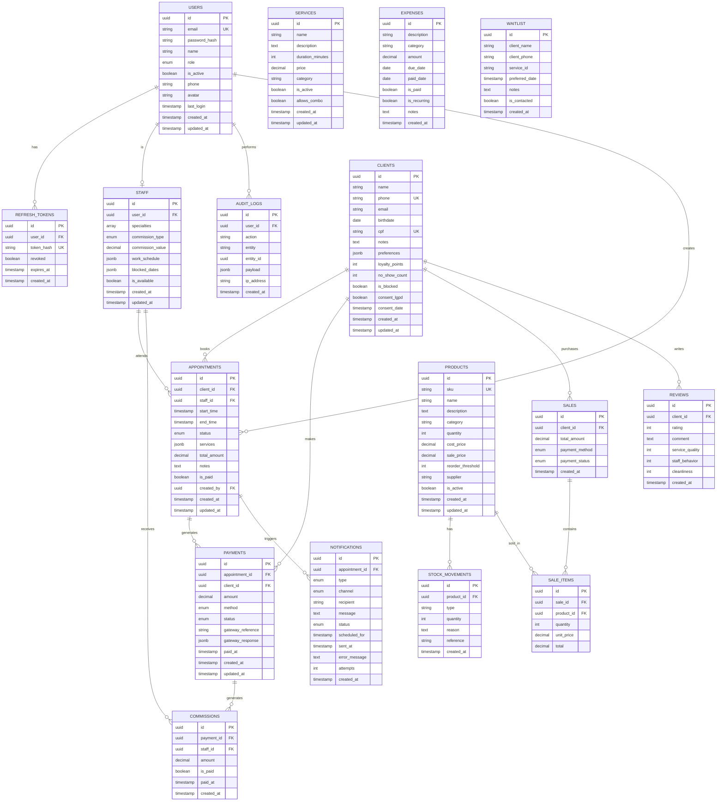

# 🗄️ Diagrama de Relacionamento do Banco de Dados

## Diagrama ER (Entity Relationship)



## Tipos Enumerados (ENUMS)

### UserRole
```sql
'ADMIN'      -- Administrador completo
'MANAGER'    -- Gerente do salão
'RECEPTION'  -- Recepcionista
'STAFF'      -- Profissional
'CLIENT'     -- Cliente (app público)
```

### CommissionType
```sql
'PERCENT'    -- Comissão percentual
'FIXED'      -- Valor fixo por serviço
'TABLE'      -- Tabela personalizada
```

### AppointmentStatus
```sql
'SCHEDULED'   -- Agendado
'CONFIRMED'   -- Confirmado pelo cliente
'IN_PROGRESS' -- Em andamento
'COMPLETED'   -- Concluído
'CANCELLED'   -- Cancelado
'NO_SHOW'     -- Cliente não compareceu
```

### PaymentMethod
```sql
'CASH'    -- Dinheiro
'DEBIT'   -- Cartão débito
'CREDIT'  -- Cartão crédito
'PIX'     -- PIX
'LINK'    -- Link de pagamento
'WALLET'  -- Carteira digital
```

### PaymentStatus
```sql
'PENDING'   -- Aguardando pagamento
'PAID'      -- Pago
'PARTIAL'   -- Pagamento parcial
'REFUNDED'  -- Reembolsado
'CANCELLED' -- Cancelado
```

### NotificationType
```sql
'CONFIRMATION'  -- Confirmação de agendamento
'REMINDER_24H'  -- Lembrete 24h antes
'REMINDER_1H'   -- Lembrete 1h antes
'CANCELLATION'  -- Cancelamento
'PROMOTION'     -- Promoção
'BIRTHDAY'      -- Aniversário
'REACTIVATION'  -- Reativação de cliente
```

### NotificationChannel
```sql
'WHATSAPP' -- WhatsApp Business
'EMAIL'    -- E-mail
'SMS'      -- SMS
'PUSH'     -- Notificação push (app)
```

### NotificationStatus
```sql
'PENDING'   -- Aguardando envio
'SENT'      -- Enviada
'DELIVERED' -- Entregue
'FAILED'    -- Falhou
```

## Relacionamentos Principais

### 1️⃣ Autenticação
- **User** → **RefreshToken** (1:N): Um usuário pode ter múltiplos tokens de refresh
- **User** → **Staff** (1:1): Um usuário pode ser um profissional
- **User** → **AuditLog** (1:N): Rastreamento de ações

### 2️⃣ Agendamentos
- **Client** → **Appointment** (1:N): Cliente faz múltiplos agendamentos
- **Staff** → **Appointment** (1:N): Profissional atende múltiplos clientes
- **User** → **Appointment** (1:N): Criador do agendamento
- **Appointment** → **Payment** (1:N): Agendamento pode ter múltiplos pagamentos
- **Appointment** → **Notification** (1:N): Notificações relacionadas

### 3️⃣ Financeiro
- **Payment** → **Commission** (1:N): Pagamento gera comissões
- **Client** → **Payment** (1:N): Histórico de pagamentos
- **Staff** → **Commission** (1:N): Comissões recebidas

### 4️⃣ Estoque
- **Product** → **StockMovement** (1:N): Histórico de movimentações
- **Product** → **SaleItem** (1:N): Produtos vendidos

### 5️⃣ Vendas (PDV)
- **Client** → **Sale** (1:N): Compras do cliente
- **Sale** → **SaleItem** (1:N): Itens da venda

### 6️⃣ CRM
- **Client** → **Review** (1:N): Avaliações do cliente

## Índices Importantes

### Performance
```sql
-- Agendamentos
idx_appointments_start_time (start_time)
idx_appointments_staff_start (staff_id, start_time)
idx_appointments_client_id (client_id)
idx_appointments_status (status)

-- Pagamentos
idx_payments_client_id (client_id)
idx_payments_status (status)
idx_payments_created_at (created_at)

-- Busca de texto
idx_clients_name_trgm (name gin_trgm_ops)
idx_products_name_trgm (name gin_trgm_ops)

-- Notificações
idx_notifications_status (status)
idx_notifications_scheduled_for (scheduled_for)
```

## Constraints e Regras

### Check Constraints
```sql
-- Agendamentos: end_time > start_time
chk_appointment_time

-- Pagamentos: amount >= 0
chk_payment_amount

-- Avaliações: rating entre 1-5
chk_review_rating

-- Produtos: quantidade >= 0
chk_product_quantity
```

### Unique Constraints
```sql
-- Usuários
users.email (único)

-- Clientes
clients.phone (único)
clients.cpf (único)

-- Produtos
products.sku (único)

-- Tokens
refresh_tokens.token_hash (único)
```

## Triggers Automáticos

### 1. Updated At
Atualiza automaticamente `updated_at` em:
- users
- staff
- clients
- services
- appointments
- payments
- products

### 2. Estoque
```sql
update_stock_on_sale()
-- Atualiza quantidade ao criar venda
-- Registra movimentação automaticamente
```

### 3. Cálculo de Totais
```sql
calculate_sale_total()
-- Recalcula total da venda quando itens mudam
```

## Views Materializadas

### daily_financial_summary
Resumo financeiro diário com totais por método de pagamento

### staff_statistics
Estatísticas completas de cada profissional

### client_summary
Visão consolidada de cada cliente

### low_stock_products
Produtos abaixo do threshold

### today_schedule
Agenda completa do dia atual

## Segurança e LGPD

### Dados Sensíveis
- Senhas: hash bcrypt (12 rounds)
- CPF: criptografia recomendada
- Consentimento LGPD: `consent_lgpd` + `consent_date`

### Auditoria
Tabela `audit_logs` registra:
- CREATE, UPDATE, DELETE
- LOGIN, LOGOUT
- IP Address
- Payload completo

### Retenção de Dados
- Refresh tokens: 7 dias após expiração
- Notificações: 6 meses
- Audit logs: 1 ano
- Dados de clientes: conforme LGPD

## Escalabilidade

### Particionamento Recomendado
- **audit_logs**: Por mês (RANGE)
- **notifications**: Por mês (RANGE)
- **appointments**: Por ano (se volume alto)

### Sharding Futuro
- Por filial/unidade
- Por região geográfica

## Backup e Recovery

### Estratégia 3-2-1
- 3 cópias dos dados
- 2 tipos de mídia diferentes
- 1 cópia off-site

### Scripts
- `backup.sh` / `backup.ps1`: Backup automatizado
- Retenção: 30 dias
- Compressão: gzip/zip

---

**Versão:** 1.0.0  
**Última Atualização:** 28/11/2025  
**Total de Tabelas:** 17  
**Total de Enums:** 8
