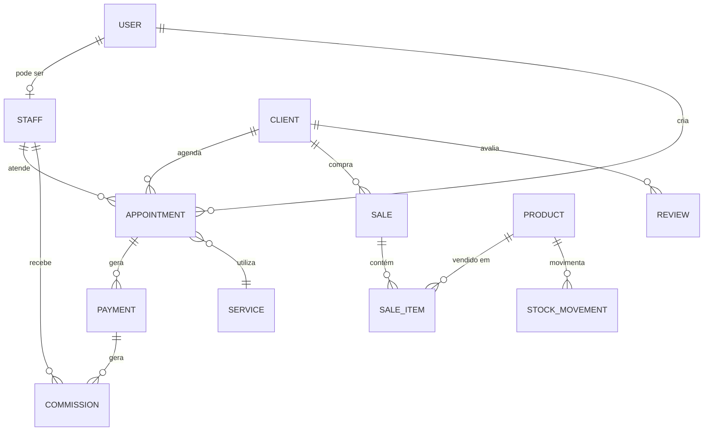

# 🏗️ Arquitetura do Sistema

## Índice

- [Visão Geral](#visão-geral)
- [Padrões de Projeto](#padrões-de-projeto)
- [Camadas da Aplicação](#camadas-da-aplicação)
- [Fluxo de Requisição](#fluxo-de-requisição)
- [Modelo de Dados](#modelo-de-dados)
- [Segurança](#segurança)
- [Escalabilidade](#escalabilidade)

---

## 🎯 Visão Geral

O Sistema de Gerenciamento para Salão de Beleza é construído seguindo os princípios de **Clean Architecture** e **SOLID**, garantindo:

- ✅ Separação de responsabilidades
- ✅ Testabilidade
- ✅ Manutenibilidade
- ✅ Escalabilidade
- ✅ Independência de frameworks

### Stack Principal

```
┌─────────────────────────────────────────┐
│          Frontend (Não incluído)         │
│      React / Next.js / Vue.js           │
└──────────────┬──────────────────────────┘
               │ HTTP/REST
               ▼
┌─────────────────────────────────────────┐
│           Backend API (Node.js)         │
│  Express.js + TypeScript + Prisma       │
└──────────────┬──────────────────────────┘
               │
      ┌────────┴────────┐
      ▼                 ▼
┌──────────┐      ┌──────────┐
│PostgreSQL│      │  Redis   │
│ (Dados)  │      │ (Cache)  │
└──────────┘      └──────────┘
```

---

## 📐 Padrões de Projeto

### 1. MVC (Model-View-Controller)

Adaptado para APIs REST:

```
Routes → Controllers → Services → Prisma (Models)
```

- **Routes**: Define endpoints e middlewares
- **Controllers**: Recebe requisições HTTP, valida entrada, retorna respostas
- **Services**: Contém lógica de negócio
- **Models**: Definidos no Prisma Schema

### 2. Repository Pattern

Prisma atua como camada de abstração do banco de dados:

```typescript
// Service usa Prisma Client
class ClientsService {
  async findAll() {
    return prisma.client.findMany();
  }
}
```

### 3. Dependency Injection

Utiliza injeção manual de dependências:

```typescript
// Exemplo
class AppointmentsService {
  constructor(
    private notificationService: NotificationService,
    private paymentService: PaymentService
  ) {}
}
```

### 4. Factory Pattern

Para criação de objetos complexos:

```typescript
class NotificationFactory {
  static create(type: NotificationType) {
    switch(type) {
      case 'whatsapp': return new WhatsAppService();
      case 'email': return new EmailService();
    }
  }
}
```

---

## 🏛️ Camadas da Aplicação

### Estrutura em Camadas

```
┌─────────────────────────────────────────┐
│         1. Presentation Layer           │ ← HTTP, Routes, Middlewares
├─────────────────────────────────────────┤
│         2. Application Layer            │ ← Controllers, Validators
├─────────────────────────────────────────┤
│         3. Business Logic Layer         │ ← Services
├─────────────────────────────────────────┤
│         4. Data Access Layer            │ ← Prisma, Repositories
├─────────────────────────────────────────┤
│         5. Infrastructure Layer         │ ← Database, Redis, External APIs
└─────────────────────────────────────────┘
```

### 1️⃣ Presentation Layer (Routes + Middlewares)

**Responsabilidades:**
- Definir endpoints HTTP
- Aplicar middlewares (auth, validação, rate limit)
- Rotear para controllers

**Exemplo:**
```typescript
// appointments.routes.ts
router.post(
  '/',
  authMiddleware,
  validate(createAppointmentSchema),
  appointmentsController.create
);
```

### 2️⃣ Application Layer (Controllers)

**Responsabilidades:**
- Receber requisições HTTP
- Extrair parâmetros (body, query, params)
- Chamar services
- Formatar e retornar respostas
- Tratar erros

**Exemplo:**
```typescript
// appointments.controller.ts
class AppointmentsController {
  async create(req: Request, res: Response) {
    const data = req.body;
    const appointment = await appointmentsService.create(data);
    return res.status(201).json({ success: true, data: appointment });
  }
}
```

### 3️⃣ Business Logic Layer (Services)

**Responsabilidades:**
- Implementar regras de negócio
- Validar lógica de domínio
- Orquestrar operações
- Interagir com banco de dados (via Prisma)
- Chamar serviços externos

**Exemplo:**
```typescript
// appointments.service.ts
class AppointmentsService {
  async create(data: CreateAppointmentDto) {
    // 1. Validar disponibilidade
    const isAvailable = await this.checkAvailability(data);
    if (!isAvailable) throw new Error('Horário indisponível');
    
    // 2. Criar agendamento
    const appointment = await prisma.appointment.create({ data });
    
    // 3. Enviar notificação
    await notificationService.sendConfirmation(appointment);
    
    return appointment;
  }
}
```

### 4️⃣ Data Access Layer (Prisma)

**Responsabilidades:**
- Abstrair acesso ao banco de dados
- Prover type-safety
- Gerenciar conexões
- Executar queries

**Exemplo:**
```typescript
// Prisma Client é usado diretamente nos services
const clients = await prisma.client.findMany({
  where: { isActive: true },
  include: { appointments: true }
});
```

### 5️⃣ Infrastructure Layer

**Responsabilidades:**
- Banco de dados (PostgreSQL)
- Cache (Redis)
- Filas de jobs (BullMQ)
- Serviços externos (WhatsApp, Email, Pagamentos)
- File storage

---

## 🔄 Fluxo de Requisição

### Fluxo Completo de uma Requisição

```
1. Cliente HTTP
   │
   ▼
2. Express.js
   │
   ▼
3. Middlewares Globais
   ├─ Helmet (Segurança)
   ├─ CORS
   ├─ Body Parser
   ├─ Compression
   └─ Rate Limiter
   │
   ▼
4. Router
   │
   ▼
5. Middlewares de Rota
   ├─ Autenticação JWT
   ├─ Validação (Zod)
   └─ Autorização (Roles)
   │
   ▼
6. Controller
   ├─ Extrai dados (req.body, req.query, req.params)
   ├─ Chama Service
   └─ Formata resposta
   │
   ▼
7. Service
   ├─ Valida regras de negócio
   ├─ Interage com Prisma
   ├─ Chama serviços externos
   └─ Retorna resultado
   │
   ▼
8. Prisma
   ├─ Monta query SQL
   ├─ Executa no PostgreSQL
   └─ Retorna dados tipados
   │
   ▼
9. Response
   ├─ Formata JSON
   ├─ Define status code
   └─ Envia ao cliente
   │
   ▼
10. Logs (Winston)
    └─ Registra requisição
```

### Exemplo Prático: POST /api/v1/appointments

```typescript
// 1. Cliente faz requisição
POST /api/v1/appointments
Headers: { Authorization: "Bearer token" }
Body: {
  clientId: "uuid",
  staffId: "uuid",
  serviceId: "uuid",
  startTime: "2025-12-01T10:00:00Z"
}

// 2. Express recebe

// 3. Middlewares globais (helmet, cors, etc.)

// 4. Router direciona para rota específica
router.post('/', authMiddleware, validate(...), controller.create)

// 5. authMiddleware verifica JWT
// 6. validate verifica schema Zod
// 7. controller.create é chamado

// 8. Controller
appointmentsController.create(req, res) {
  const data = req.body;
  
  // 9. Chama Service
  const appointment = await appointmentsService.create(data);
  
  // 10. Retorna resposta
  res.status(201).json({ success: true, data: appointment });
}

// 11. Service (lógica de negócio)
appointmentsService.create(data) {
  // Verifica disponibilidade
  // Cria no banco via Prisma
  // Envia notificação
  // Retorna appointment
}

// 12. Prisma executa SQL
INSERT INTO appointments (...) VALUES (...)

// 13. Resposta JSON enviada ao cliente
{
  "success": true,
  "data": {
    "id": "uuid",
    "clientId": "uuid",
    ...
  }
}
```

---

## 🗄️ Modelo de Dados

### Entidades Principais



### Relacionamentos Principais

| Entidade | Relação | Entidade | Tipo |
|----------|---------|----------|------|
| User | 1:1 | Staff | One-to-One |
| Staff | 1:N | Appointment | One-to-Many |
| Client | 1:N | Appointment | One-to-Many |
| Appointment | 1:N | Payment | One-to-Many |
| Payment | 1:N | Commission | One-to-Many |
| Product | 1:N | StockMovement | One-to-Many |
| Sale | 1:N | SaleItem | One-to-Many |

---

## 🔐 Segurança

### Camadas de Segurança

```
┌─────────────────────────────────────────┐
│  1. Network Layer                       │
│     - HTTPS/TLS                         │
│     - Firewall                          │
└─────────────────────────────────────────┘
┌─────────────────────────────────────────┐
│  2. Application Layer                   │
│     - Helmet (Security Headers)         │
│     - CORS (Origin Control)             │
│     - Rate Limiting                     │
└─────────────────────────────────────────┘
┌─────────────────────────────────────────┐
│  3. Authentication Layer                │
│     - JWT (Access + Refresh Tokens)     │
│     - bcrypt (Password Hashing)         │
└─────────────────────────────────────────┘
┌─────────────────────────────────────────┐
│  4. Authorization Layer                 │
│     - Role-Based Access Control (RBAC)  │
│     - Permission Checks                 │
└─────────────────────────────────────────┘
┌─────────────────────────────────────────┐
│  5. Data Layer                          │
│     - SQL Injection Prevention (Prisma) │
│     - Input Validation (Zod)            │
│     - Data Sanitization                 │
└─────────────────────────────────────────┘
┌─────────────────────────────────────────┐
│  6. Audit Layer                         │
│     - Logs (Winston)                    │
│     - Audit Trail (AuditLog table)      │
│     - Error Tracking (Sentry)           │
└─────────────────────────────────────────┘
```

### Fluxo de Autenticação

```
1. Login
   │
   ▼
2. Validar credenciais
   │
   ▼
3. Gerar tokens
   ├─ Access Token (15min)
   └─ Refresh Token (30d)
   │
   ▼
4. Armazenar Refresh Token no DB
   │
   ▼
5. Retornar tokens ao cliente
   │
   ▼
6. Cliente usa Access Token em requisições
   │
   ▼
7. Quando Access Token expira
   │
   ▼
8. Cliente usa Refresh Token
   │
   ▼
9. Validar Refresh Token
   │
   ▼
10. Gerar novo Access Token
```

### RBAC (Role-Based Access Control)

```typescript
enum UserRole {
  ADMIN     // Acesso total
  MANAGER   // Gestão completa (exceto config)
  RECEPTION // Agendamentos, clientes
  STAFF     // Visualização limitada
  CLIENT    // Apenas seus dados
}

// Middleware de autorização
function authorize(...roles: UserRole[]) {
  return (req, res, next) => {
    if (!roles.includes(req.user.role)) {
      return res.status(403).json({ error: 'Forbidden' });
    }
    next();
  };
}

// Uso
router.delete('/clients/:id', 
  authMiddleware, 
  authorize(UserRole.ADMIN, UserRole.MANAGER),
  controller.delete
);
```

---

## 📈 Escalabilidade

### Estratégias de Escalabilidade

#### 1. Horizontal Scaling (Scale Out)

```
┌─────────────┐
│Load Balancer│
└──────┬──────┘
       │
   ┌───┴───┬───────┬───────┐
   │       │       │       │
   ▼       ▼       ▼       ▼
┌─────┐ ┌─────┐ ┌─────┐ ┌─────┐
│API 1│ │API 2│ │API 3│ │API 4│
└──┬──┘ └──┬──┘ └──┬──┘ └──┬──┘
   └───┬───┴───┬───┴───┬───┘
       │       │       │
       ▼       ▼       ▼
   ┌───────────────────────┐
   │      PostgreSQL       │
   │    (Read Replicas)    │
   └───────────────────────┘
```

#### 2. Caching Strategy

```
Request → Cache? → Yes → Return
          │
          No
          │
          ▼
       Database → Update Cache → Return
```

**Implementação com Redis:**
```typescript
async getClient(id: string) {
  // Tentar buscar no cache
  const cached = await redis.get(`client:${id}`);
  if (cached) return JSON.parse(cached);
  
  // Se não estiver no cache, buscar no DB
  const client = await prisma.client.findUnique({ where: { id } });
  
  // Armazenar no cache (TTL: 1h)
  await redis.set(`client:${id}`, JSON.stringify(client), 'EX', 3600);
  
  return client;
}
```

#### 3. Database Optimization

**Indexes:**
```prisma
model Client {
  id    String @id @default(uuid())
  email String @unique
  phone String @unique
  
  @@index([email])
  @@index([phone])
}
```

**Connection Pooling:**
```typescript
// prisma/schema.prisma
datasource db {
  provider = "postgresql"
  url      = env("DATABASE_URL")
  
  // Connection pool
  connection_limit = 10
}
```

#### 4. Background Jobs (BullMQ)

```
API → Add Job to Queue → Continue Response
                          │
                          ▼
                    Worker processes job
                    (send email, etc.)
```

**Exemplo:**
```typescript
// Adicionar job
await notificationQueue.add('send-reminder', {
  appointmentId: 'uuid',
  type: 'whatsapp'
});

// Worker processa
notificationWorker.process(async (job) => {
  const { appointmentId } = job.data;
  await whatsappService.sendReminder(appointmentId);
});
```

#### 5. CDN para Assets

```
Client → CDN → Cache Hit? → Return
               │
               Cache Miss
               │
               ▼
            Origin Server → Update CDN → Return
```

---

## 🧩 Módulos e Responsabilidades

| Módulo | Responsabilidade | Principais Operações |
|--------|------------------|---------------------|
| **Auth** | Autenticação e autorização | Login, registro, refresh token |
| **Clients** | Gestão de clientes | CRUD, histórico, reativação |
| **Appointments** | Agendamentos | CRUD, disponibilidade, confirmação |
| **Staff** | Profissionais | CRUD, horários, especialidades |
| **Services** | Serviços oferecidos | CRUD, categorização |
| **Payments** | Pagamentos | Registrar, confirmar, reembolsar |
| **Products** | Estoque | CRUD, movimentações |
| **Sales** | PDV | Registrar vendas |
| **Expenses** | Despesas | CRUD, marcar como pago |
| **Reports** | Relatórios | Dashboard, financeiro, comissões |
| **Reviews** | Avaliações | CRUD, estatísticas |
| **Waitlist** | Lista de espera | Adicionar, contatar, remover |
| **Webhooks** | Integrações externas | WhatsApp, pagamentos |

---

## 📝 Convenções de Código

### Nomenclatura

```typescript
// Classes: PascalCase
class AppointmentsService { }

// Funções/métodos: camelCase
async function createAppointment() { }

// Constantes: UPPER_SNAKE_CASE
const MAX_APPOINTMENTS_PER_DAY = 20;

// Arquivos: kebab-case
// appointments.controller.ts
// auth.middleware.ts

// Tipos/Interfaces: PascalCase
interface CreateAppointmentDto { }
type UserRole = 'ADMIN' | 'MANAGER';
```

### Estrutura de Arquivos

```typescript
// 1. Imports (libs externas)
import express from 'express';
import { Request, Response } from 'express';

// 2. Imports (internos - utils, config)
import { logger } from '@/utils/logger';
import { env } from '@/config/env';

// 3. Imports (serviços/controllers)
import { AppointmentsService } from './appointments.service';

// 4. Tipos/Interfaces
interface CreateAppointmentDto { }

// 5. Classe/Função principal
class AppointmentsController { }

// 6. Export
export default new AppointmentsController();
```

---

## 🧪 Testabilidade

### Arquitetura Facilita Testes

```
┌─────────────────────────┐
│   Unit Tests            │
│   - Services            │
│   - Utils               │
│   - Validators          │
└─────────────────────────┘
┌─────────────────────────┐
│   Integration Tests     │
│   - Controllers         │
│   - Routes              │
│   - Database            │
└─────────────────────────┘
┌─────────────────────────┐
│   E2E Tests             │
│   - Fluxos completos    │
│   - API endpoints       │
└─────────────────────────┘
```

---

## 📚 Referências

- [Clean Architecture](https://blog.cleancoder.com/uncle-bob/2012/08/13/the-clean-architecture.html)
- [SOLID Principles](https://en.wikipedia.org/wiki/SOLID)
- [Twelve-Factor App](https://12factor.net/)
- [RESTful API Design](https://restfulapi.net/)
- [Prisma Best Practices](https://www.prisma.io/docs/guides/performance-and-optimization)

---

**Última atualização:** 1 de dezembro de 2025
